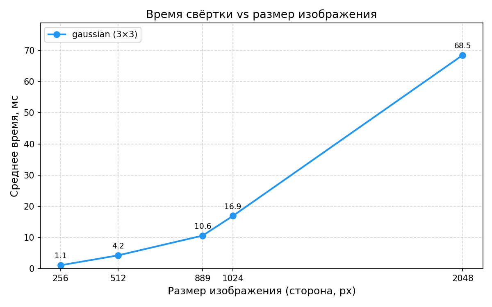
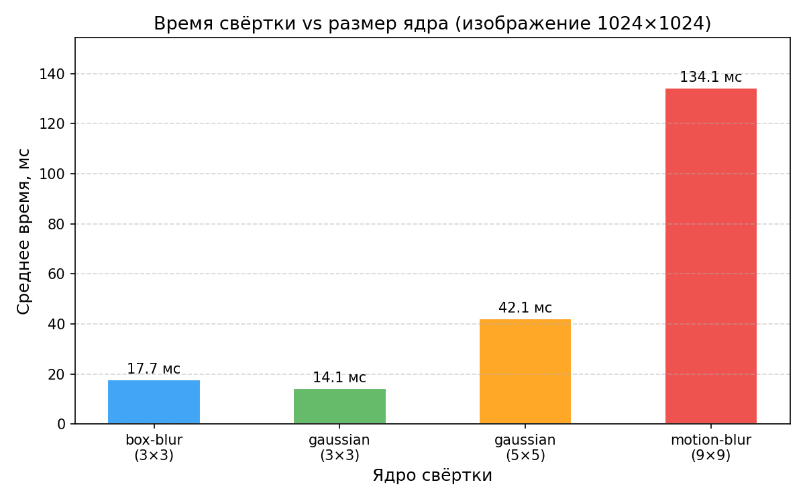

# Задача 1 — последовательная свёртка

Последовательная свёртка одного изображения с заданным ядром. Реализация — см. [`core/.../Convolution.kt`](../core/src/main/kotlin/workshop/parallels/core/Convolution.kt).

## Бенчмарки

Инструмент: JMH 1.37, JDK 21, 1 fork, 3 warmup + 5 measurement iterations по 10 с каждая.

**График 1** — зависимость времени от размера изображения (ядро: gaussian 3×3):

**График 2** — зависимость времени от размера ядра (изображение 1024×1024):

## Краткий анализ

**Зависимость от размера изображения** подтверждает теоретическую сложность O(W·H): при учетверении числа пикселей (256→512, 512→1024, 1024→2048) время растёт примерно в 4 раза — 1.1 → 4.2 → 16.9 → 68.5 мс.

**Зависимость от размера ядра** демонстрирует O(K²): переход с 3×3 (gaussian, 14.1 мс) на 5×5 (42.1 мс) даёт рост ~3×, а на 9×9 (motion-blur, 134.1 мс) — ~9.5×, что близко к теоретическому (25/9 ≈ 2.8× и 81/9 = 9×).

Небольшое отклонение box-blur (17.7 мс) от gaussian (14.1 мс) при одинаковом размере 3×3 объясняется структурой ядра: box-blur имеет 9 ненулевых элементов против 5 у базового gaussian — JIT хуже оптимизирует плотное умножение.

Последовательная реализация является базовой линией для сравнения с параллельными стратегиями в задаче 2.
