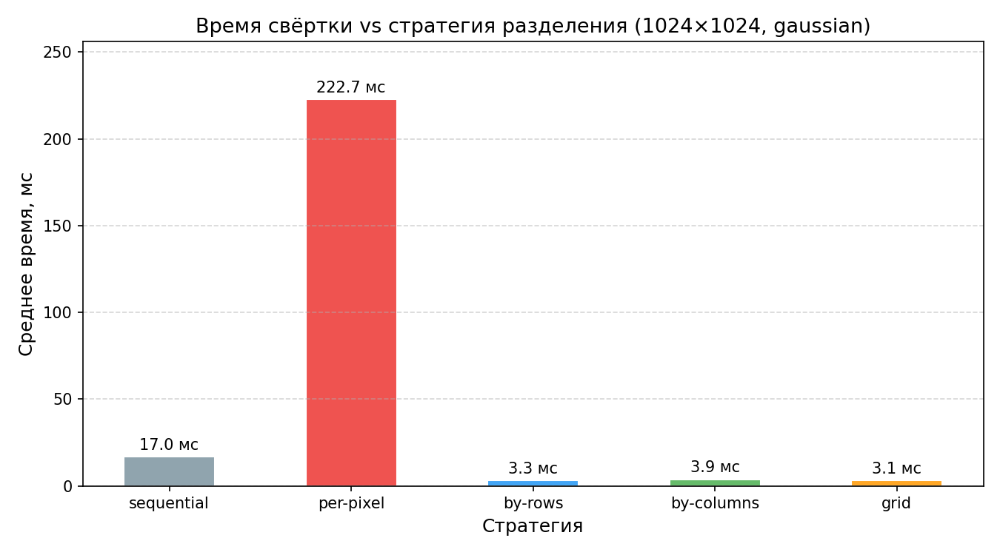
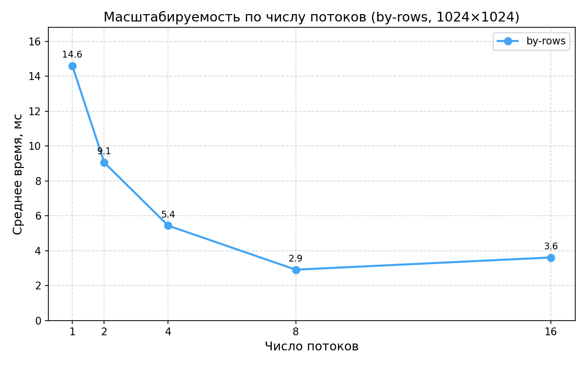
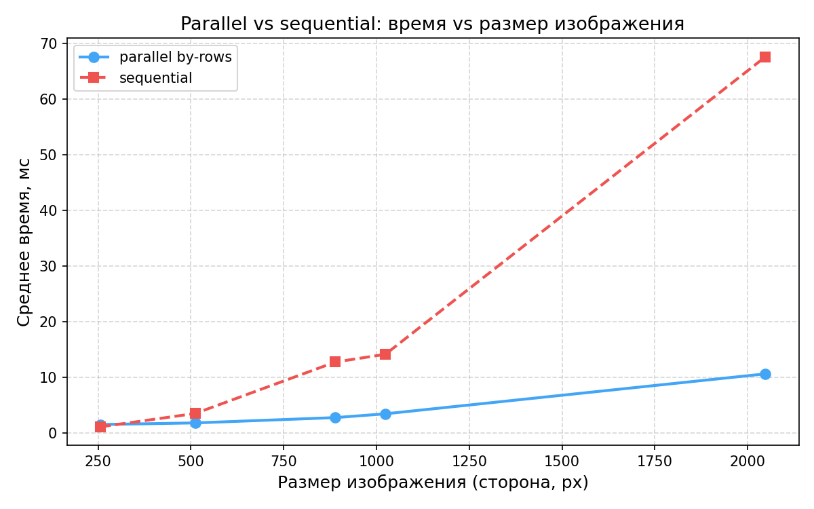

# Задача 2 — параллельная свёртка

Параллельная свёртка одного изображения с четырьмя стратегиями разделения работы между потоками. Реализация — [`core/.../ParallelConvolution.kt`](../core/src/main/kotlin/workshop/parallels/core/ParallelConvolution.kt).

## Стратегии разделения

| Стратегия    | Описание                                                                |
| ------------ | ----------------------------------------------------------------------- |
| `per-pixel`  | Каждая задача обрабатывает один пиксель                                 |
| `by-rows`    | Строки делятся между потоками равными полосами                          |
| `by-columns` | Столбцы делятся между потоками равными полосами                         |
| `grid`       | Изображение делится на прямоугольные блоки `block-width × block-height` |

Механизм параллелизма — `ExecutorService (newFixedThreadPool(n))`. Каждая задача пишет в непересекающиеся индексы `IntArray`, поэтому синхронизация не нужна; happens-before гарантируется `Future.get()`.

## Запуск CLI

```bash
make task2 ARGS="-i samples/img4.jpg -o out/task2.png -k gaussian -s by-rows -t 8"
make task2 ARGS="-s by-columns -t 8"
make task2 ARGS="-s per-pixel -t 8"
make task2 ARGS="-s grid --block-width=64 --block-height=64 -t 8"
```

## Бенчмарки

JMH 1.36, JDK 21, 1 fork, 3 warmup + 5 measurement iterations по 10 с каждая.

```bash
make bench TASK=2   # только бенчмарки задачи 2
make plots TASK=2   # графики в docs/plots/
```

**График 3** — сравнение стратегий (img4, 1024×1024, gaussian 3×3, потоки = `availableProcessors`):



**График 4** — масштабируемость `by-rows` по числу потоков (img4, gaussian 3×3):



**График 5** — `parallel by-rows` vs `sequential` для разных размеров изображения:



## Анализ

### График 3

Время свёртки на img4 (1024×1024, gaussian 3×3): sequential — 17.0 мс, per-pixel — 222.7 мс, by-rows — 3.3 мс, by-columns — 3.9 мс, grid 64×64 — 3.1 мс.

`per-pixel` создаёт `width × height` задач (≈1.05 млн на 1024×1024). Стоимость постановки в очередь и `Future.get()` для каждой задачи превышает стоимость самой свёртки одного пикселя на ядре 3×3.

`by-rows` и `grid` дают близкий результат, потому что обе стратегии читают пиксели последовательно по строкам, что соответствует row-major хранению `IntArray`. `by-columns` медленнее на 18%: внутренний цикл идёт по `y`, при шаге чтения `width × 4` байт на каждой итерации происходит cache miss. На ядре 3×3 разница ограничена — три соседние строки всё равно подгружаются предвыборкой.

### График 4

Время свёртки на img4 при разном числе потоков (стратегия by-rows): 1 — 14.6 мс, 2 — 9.1 мс, 4 — 5.4 мс, 8 — 2.9 мс, 16 — 3.6 мс.

До 8 потоков время убывает почти пропорционально количеству потоков. При 16 потоках наблюдается рост: 8 потоков уже занимают все физические ядра тестовой машины, дальнейшее увеличение приводит к конкуренции за CPU и накладным расходам на переключение контекста.

При 1 потоке `convolveParallel` (14.6 мс) сопоставим с `convolve` (17.0 мс) — overhead создания пула из одного потока невелик.

### График 5

Время свёртки в зависимости от размера изображения (sequential vs parallel by-rows):

- 256×256: 1.1 vs 1.5 мс
- 512×512: 3.5 vs 1.8 мс
- 889×889: 12.7 vs 2.7 мс
- 1024×1024: 14.1 vs 3.4 мс
- 2048×2048: 67.6 vs 10.6 мс

На 256×256 параллельная версия медленнее последовательной — фиксированная стоимость создания `ExecutorService` и постановки задач в очередь больше, чем выигрыш от распараллеливания на ~65 тыс. пикселей. Точка окупаемости находится в районе 512×512. На 2048×2048 ускорение составляет ×6.4, что близко к практическому потолку на 8 ядрах с учётом overhead'а пула, включаемого в каждое измерение.
