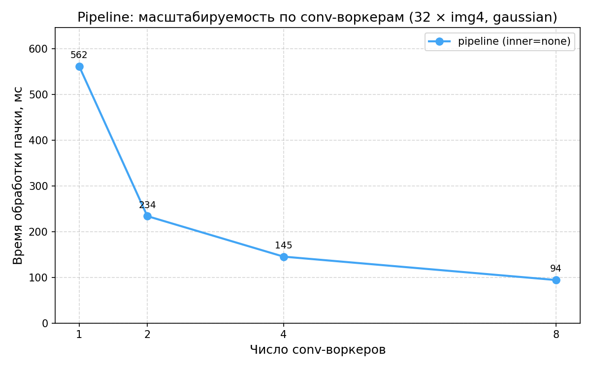
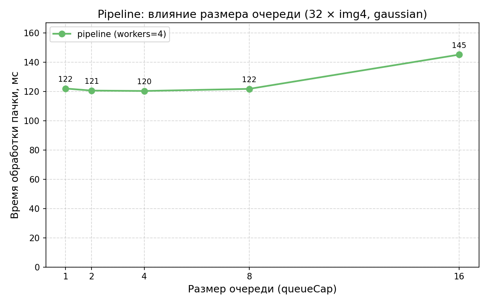
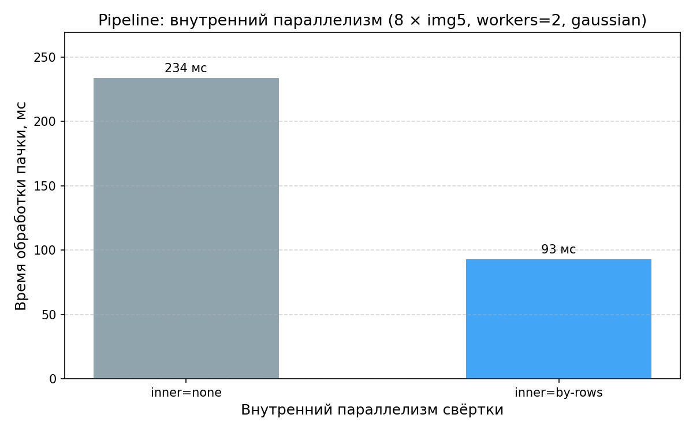

# Задача 3 — pipeline-обработка массива изображений

Pipeline-обработка массива изображений: три стадии (reader → conv → writer) с bounded-очередями между ними. Reader блокируется при заполнении очереди — память не растёт бесконтрольно. Реализация — [`core/.../Pipeline.kt`](../core/src/main/kotlin/workshop/parallels/core/Pipeline.kt).

## Архитектура

| Стадия  | Поток                                | Назначение                                          |
| ------- | ------------------------------------ | --------------------------------------------------- |
| reader  | `Executors.newSingleThreadExecutor`  | кладёт `(index, image)` в `inputQueue`              |
| conv    | `Executors.newFixedThreadPool(N)`    | N воркеров берут из `inputQueue`, считают свёртку   |
| writer  | `Executors.newSingleThreadExecutor`  | собирает результаты в массив по `index`             |

Между стадиями — `ArrayBlockingQueue(queueCap)`. Завершение воркеров — poison pill (`InputItem.Poison`), по одному на каждого воркера. Backpressure обеспечивается блокирующим `put()` — reader не уходит вперёд более чем на `queueCap + convWorkers + 1` картинок (формально доказано в unit-тесте `bounded queue: число картинок в полёте не превышает queueCap + convWorkers`).

Свёртка внутри одной картинки настраивается параметром `innerStrategy`:

- `null` — последовательно (`Convolution.convolve`, один поток);
- `ParallelStrategy.*` — параллельно (`convolveParallel` из задачи 2).

## Запуск CLI

```bash
make task3 ARGS="-i samples -o out/task3 -k gaussian --conv-workers 4 --queue-cap 4"
make task3 ARGS="--conv-workers 2 --inner by-rows"
```

## Бенчмарки

JMH 1.36, JDK 21, 1 fork, 3 warmup + 5 measurement iterations по 10 с каждая.

```bash
make bench TASK=3   # только бенчмарки задачи 3
make plots TASK=3   # графики в docs/plots/
```

**График 1** — масштабируемость pipeline по числу conv-воркеров (32 копии img4 1024×1024, gaussian 3×3, cap=4, inner=none):



**График 2** — влияние размера очереди (32 копии img4, workers=4, inner=none):



**График 3** — внутренний параллелизм свёртки (8 копий img5 2048×2048, workers=2):



## Анализ

### График 1

Время обработки пачки из 32 копий img4 (1024×1024, gaussian 3×3) при разном числе conv-воркеров: 1 — 561.8 мс, 2 — 234.0 мс, 4 — 145.3 мс, 8 — 94.1 мс.

При `convWorkers=1` pipeline эквивалентен последовательной обработке списка `images.map { convolve(it, k) }` — это baseline ≈ task1 на массиве. С 2 воркерами получаем ускорение ×2.4, с 4 — ×3.9, с 8 — ×6.0. Превышение «идеальных» ×2 на двух воркерах объясняется перекрытием стадий: пока один conv-воркер считает картинку N, второй уже считает N+1, а reader подаёт N+2. На 8 воркерах кривая сублинейная — ×6 вместо ×8: на 8-ядерной машине свободных ядер для reader/writer не остаётся, и три однопоточные стадии (reader, writer) и 8 conv-воркеров конкурируют за CPU. Картинки в бенче загружены в `@Setup`, поэтому диск не участвует — узкое место именно в CPU-конкуренции.

### График 2

Время обработки той же пачки при `convWorkers=4` и разном размере очереди: cap=1 — 121.9 мс, cap=2 — 120.5 мс, cap=4 — 120.2 мс, cap=8 — 121.7 мс, cap=16 — 145.1 мс.

В диапазоне cap ∈ {1, 2, 4, 8} времена практически совпадают — буфер размером 1 уже даёт перекрытие чтения и свёртки, потому что в нашем бенче стадии примерно равной длительности. Деградация при cap=16 (+20%) — вероятно, рост cache pressure: pipeline одновременно держит до ~20 распакованных копий 1024×1024 (по 4 МБ каждая, итого ~80 МБ), что выходит за типичный L3 (8–32 МБ) и заставляет conv-воркеры читать пиксели из RAM, а не из кэша. Это **гипотеза, не доказательство** — точный профиль требует `perf stat`. Практический вывод не зависит от причины: маленькие очереди не вредят производительности и обязательны для контроля памяти.

### График 3

Время обработки 8 копий img5 (2048×2048, gaussian 3×3) при `convWorkers=2`: inner=none — 234.1 мс, inner=by-rows — 93.4 мс (ускорение ×2.5).

При `convWorkers=2` без внутреннего параллелизма используется только 2 ядра из 8 — каждый воркер крутит однопоточную `convolve`. `inner=BY_ROWS` поднимает внутри каждой свёртки свой `convolveParallel` на `availableProcessors` потоков, и оставшиеся ядра дозагружаются. Это выгодно, когда картинок мало и они большие: `convWorkers` ограничен сверху размером пачки, и без внутреннего параллелизма ядра простаивают. Обратный случай — много маленьких картинок — описан в анализе task2, график 5: на 256×256 параллельная свёртка медленнее последовательной из-за overhead'а пула, и `inner=null` будет выгоднее. Параметр `innerStrategy` позволяет выбрать режим под конкретный профиль нагрузки.

### Контроль памяти

В pipeline одновременно «в полёте» находятся: до `queueCap` картинок в `inputQueue`, до `queueCap` в `outputQueue`, по одной у каждого conv-воркера, и одна у reader'а перед блокирующим `put()`. Итого пиковая память: `(2 × queueCap + convWorkers + 1) × image_size`. При `queueCap=4`, `convWorkers=4` и img5 (2048² × 4 байта = 16 МБ) — потолок ~208 МБ независимо от размера входного потока. Это гарантия из bounded `ArrayBlockingQueue`, формально проверена в unit-тесте: при искусственно замедленной свёртке reader не уходит вперёд более чем на `queueCap + convWorkers + 1` относительно conv. Аналогичный backpressure действует от writer'а к conv через `outputQueue` — если запись тупит, conv-воркеры блокируются на `put()`, и далее reader на своём `put()`.
